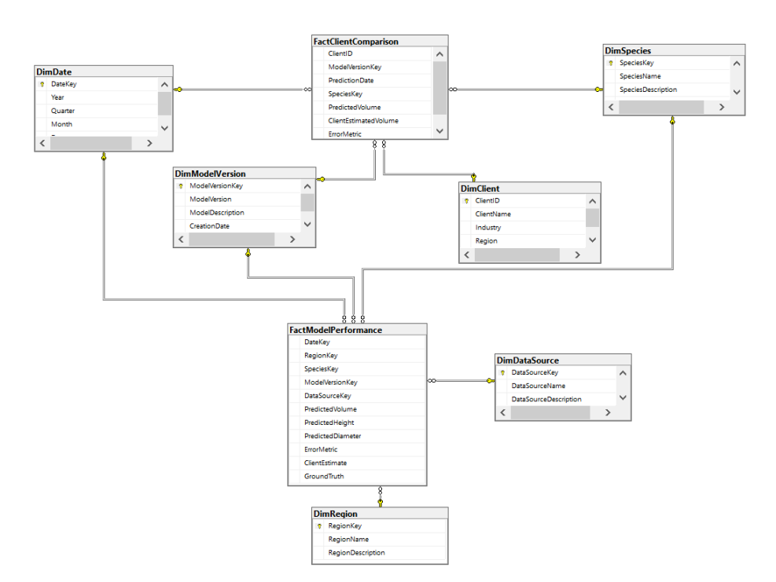

# Projet Data Warehousing pour ForestAI

## Contexte du projet

**ForestAI** est une entreprise innovante spécialisée dans la prédiction de l'inventaire forestier à l'aide de technologies avancées d'intelligence artificielle (IA) et de science des données. L'objectif principal de ForestAI est d'aider les gestionnaires forestiers et les exploitants à identifier les zones forestières potentielles pour la récolte et l'achat, tout en réduisant les coûts liés aux visites sur le terrain et en améliorant la précision des décisions.

ForestAI utilise une combinaison de **données climatiques**, **géographiques** et **processus clients** pour anticiper l'évolution des ressources forestières. L'approche inclut la prédiction de variables importantes telles que le volume de bois, la croissance des arbres et d'autres paramètres essentiels à la gestion durable des forêts.

### Problématique :
Le processus de validation et de comparaison des modèles prédictifs utilisés par ForestAI souffre de plusieurs limitations :
- **Non-standardisation des pipelines** : Les pipelines de données utilisés pour le benchmarking et la validation des modèles ne sont pas uniformes, ce qui entraîne des duplications d'efforts.
- **Manque de visualisation des résultats** : Les résultats des analyses sont souvent fournis sous forme de tableaux ou de feuilles de calcul statiques, rendant difficile l'interprétation des données.
- **Mauvaise expérience utilisateur** : La plateforme existante n'offre pas une visualisation dynamique ni une expérience fluide pour les utilisateurs finaux, limitant l'efficacité de l'analyse.

### Objectifs du projet :
1. **Standardisation des pipelines de données** : Mettre en place un pipeline unique et centralisé pour traiter les données provenant de diverses sources, en garantissant une approche réutilisable.
2. **Optimisation de l’analyse des données** : Créer un entrepôt de données (Data Warehouse) qui consolide toutes les données hétérogènes pour améliorer l'accès à des informations fiables et cohérentes.
3. **Amélioration des performances** : Réduire les temps d'exécution des requêtes et des analyses en introduisant un stockage intermédiaire et des Data Marts optimisés.
4. **Création de tableaux de bord interactifs** : Générer des visualisations interactives via Power BI pour une meilleure prise de décision en temps réel.

## Prérequis
Avant de commencer, assurez-vous que vous avez installé :
- **Microsoft SQL Server 2019+**
- **SSIS (SQL Server Integration Services)**
- **SSAS (SQL Server Analysis Services)**
- **Power BI Desktop**

## Architecture du projet
Le projet comprend plusieurs composants clés :
- **Entrepôt de données (Data Warehouse)** : Basé sur **Microsoft SQL Server**, il centralise toutes les données hétérogènes (climatiques, géographiques, inventaire forestier, etc.).
- **Data Marts** : Deux Data Marts principaux ont été développés pour analyser la performance des modèles et comparer les prédictions avec les estimations clients.
- **Cubes OLAP** : Création de cubes OLAP avec **SQL Server Analysis Services (SSAS)** pour faciliter les calculs et les requêtes multidimensionnelles.
- **Pipelines ETL** : Utilisation de **SQL Server Integration Services (SSIS)** pour l'extraction, la transformation et le chargement (ETL) des données dans l'entrepôt de données.
- **Tableaux de bord** : Génération de rapports et de tableaux de bord dynamiques avec **Power BI** pour visualiser les performances des modèles et les analyses de benchmark.

### Schéma du Datawarehouse

### Schéma des DataMarts

### Création des cubes

### Création des tableaux de bord

